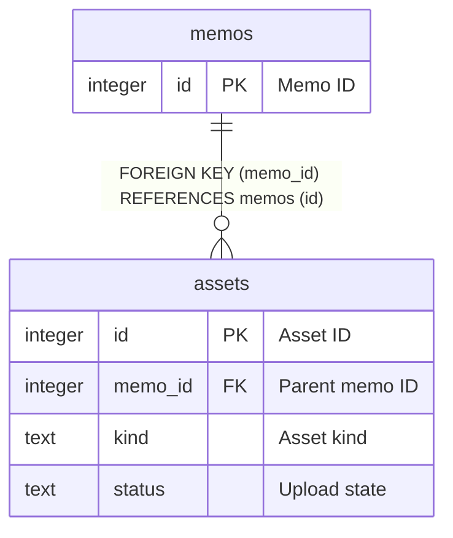

# assets

## Description

<details>
<summary><strong>Table Definition</strong></summary>

```sql
CREATE TABLE assets (
  id INTEGER PRIMARY KEY AUTOINCREMENT,
  memo_id INTEGER NOT NULL REFERENCES memos(id) ON DELETE CASCADE,
  kind TEXT NOT NULL DEFAULT 'screenshot',
  local_path TEXT NOT NULL,
  mime_type TEXT NOT NULL DEFAULT 'image/png',
  file_size INTEGER,
  sha256 TEXT,
  status TEXT NOT NULL DEFAULT 'local',
  s3_bucket TEXT,
  s3_key TEXT,
  s3_url TEXT,
  uploaded_at TEXT,
  error_message TEXT,
  created_at TEXT NOT NULL DEFAULT (strftime('%Y-%m-%dT%H:%M:%SZ', 'now')),
  updated_at TEXT NOT NULL DEFAULT (strftime('%Y-%m-%dT%H:%M:%SZ', 'now'))
);
```

</details>

## Columns

| Name | Type | Default | Nullable | Extra Definition | Children | Parents | Comment |
| ---- | ---- | ------- | -------- | ---------------- | -------- | ------- | ------- |
| id | integer |  | false | PRIMARY KEY AUTOINCREMENT |  |  | Asset ID |
| memo_id | integer |  | false | FOREIGN KEY |  | [memos](memos.md) | Parent memo ID |
| kind | text | 'screenshot' | false | DEFAULT |  |  | Asset kind |
| local_path | text |  | false |  |  |  | Local file path |
| mime_type | text | 'image/png' | false | DEFAULT |  |  | MIME type |
| file_size | integer |  | true |  |  |  | File size (bytes) |
| sha256 | text |  | true |  |  |  | File hash |
| status | text | 'local' | false | DEFAULT |  |  | Upload state |
| s3_bucket | text |  | true |  |  |  | S3 bucket |
| s3_key | text |  | true |  |  |  | S3 object key |
| s3_url | text |  | true |  |  |  | S3 URL/cache field |
| uploaded_at | text |  | true |  |  |  | Uploaded at (UTC ISO8601) |
| error_message | text |  | true |  |  |  | Last upload error |
| created_at | text | `strftime('%Y-%m-%dT%H:%M:%SZ', 'now')` | false | DEFAULT |  |  | Created at (UTC ISO8601) |
| updated_at | text | `strftime('%Y-%m-%dT%H:%M:%SZ', 'now')` | false | DEFAULT |  |  | Updated at (UTC ISO8601) |

## Constraints

| Name | Type | Definition |
| ---- | ---- | ---------- |
| (inline) | PRIMARY KEY | PRIMARY KEY (id AUTOINCREMENT) |
| (inline) | FOREIGN KEY | FOREIGN KEY (memo_id) REFERENCES memos(id) ON DELETE CASCADE |

## Indexes

| Name | Definition |
| ---- | ---------- |
| idx_assets_memo_id | INDEX ON assets(memo_id) |
| idx_assets_status | INDEX ON assets(status) |

## Relations



---

> Generated manually based on `services/data/memos.db`
