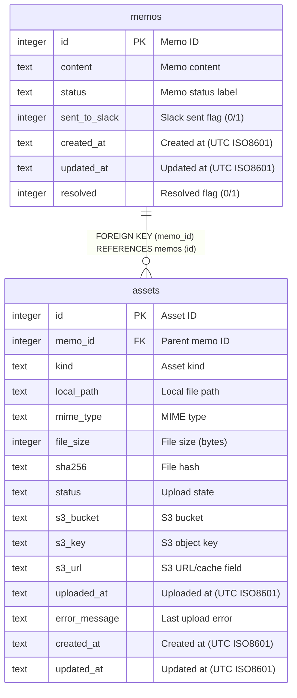

# memos

## Description

<details>
<summary><strong>Table Definition</strong></summary>

```sql
CREATE TABLE memos (
  id INTEGER PRIMARY KEY AUTOINCREMENT,
  content TEXT NOT NULL,
  status TEXT,
  sent_to_slack INTEGER NOT NULL DEFAULT 0,
  created_at TEXT NOT NULL DEFAULT (strftime('%Y-%m-%dT%H:%M:%SZ', 'now')),
  updated_at TEXT,
  resolved INTEGER NOT NULL DEFAULT 0
);
```

</details>

## Columns

| Name | Type | Default | Nullable | Extra Definition | Children | Parents | Comment |
| ---- | ---- | ------- | -------- | ---------------- | -------- | ------- | ------- |
| id | integer |  | false | PRIMARY KEY AUTOINCREMENT | [assets](assets.md) |  | Memo ID |
| content | text |  | false |  |  |  | Memo content |
| status | text |  | true |  |  |  | Memo status label |
| sent_to_slack | integer | 0 | false | DEFAULT |  |  | Slack sent flag (0/1) |
| created_at | text | `strftime('%Y-%m-%dT%H:%M:%SZ', 'now')` | false | DEFAULT |  |  | Created at (UTC ISO8601) |
| updated_at | text |  | true |  |  |  | Updated at (UTC ISO8601) |
| resolved | integer | 0 | false | DEFAULT |  |  | Resolved flag (0/1) |

## Constraints

| Name | Type | Definition |
| ---- | ---- | ---------- |
| (inline) | PRIMARY KEY | PRIMARY KEY (id AUTOINCREMENT) |

## Indexes

| Name | Definition |
| ---- | ---------- |
| idx_memos_created_at | INDEX ON memos(created_at DESC) |

## Relations



---

> Generated manually based on `services/data/memos.db`
