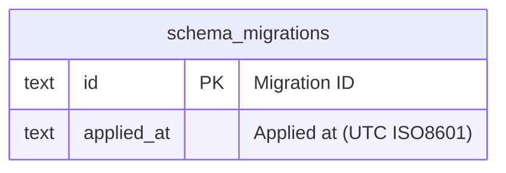

# schema_migrations

## Description

<details>
<summary><strong>Table Definition</strong></summary>

```sql
CREATE TABLE schema_migrations (
  id TEXT PRIMARY KEY,
  applied_at TEXT NOT NULL DEFAULT (strftime('%Y-%m-%dT%H:%M:%SZ', 'now'))
);
```

</details>

## Columns

| Name | Type | Default | Nullable | Extra Definition | Children | Parents | Comment |
| ---- | ---- | ------- | -------- | ---------------- | -------- | ------- | ------- |
| id | text |  | false | PRIMARY KEY |  |  | Migration ID |
| applied_at | text | `strftime('%Y-%m-%dT%H:%M:%SZ', 'now')` | false | DEFAULT |  |  | Applied at (UTC ISO8601) |

## Constraints

| Name | Type | Definition |
| ---- | ---- | ---------- |
| schema_migrations_pkey (autoindex) | PRIMARY KEY | PRIMARY KEY (id) |

## Indexes

| Name | Definition |
| ---- | ---------- |
| sqlite_autoindex_schema_migrations_1 | PRIMARY KEY (id) |

## Relations



---

> Generated manually based on `services/data/memos.db`
