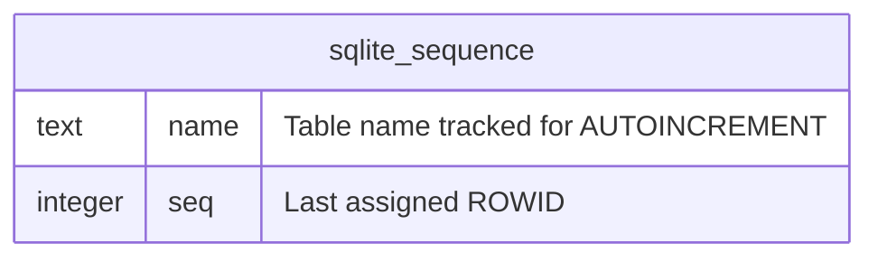

# sqlite_sequence

## Description

<details>
<summary><strong>Table Definition</strong></summary>

```sql
CREATE TABLE sqlite_sequence(
  name,
  seq
);
```

</details>

## Columns

| Name | Type | Default | Nullable | Extra Definition | Children | Parents | Comment |
| ---- | ---- | ------- | -------- | ---------------- | -------- | ------- | ------- |
| name |  |  | true |  |  |  | Table name tracked for AUTOINCREMENT |
| seq |  |  | true |  |  |  | Last assigned ROWID |

## Constraints

| Name | Type | Definition |
| ---- | ---- | ---------- |
| (none) |  |  |

## Indexes

| Name | Definition |
| ---- | ---------- |
| (none) |  |

## Relations



---

> Generated manually based on `services/data/memos.db`
